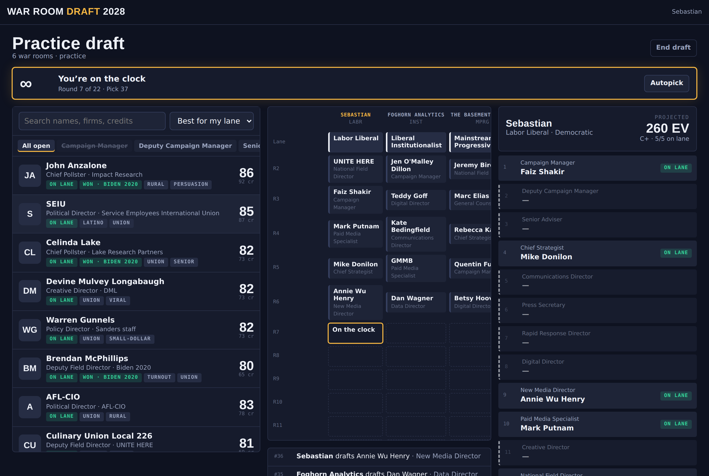

# War Room Draft 2028

Fantasy football, except you draft the campaign instead of the candidate.

You and up to eleven other people each build a presidential war room: first you
pick an ideological lane, then you draft 21 real operatives — the pollster, the
ad maker, the field director, the lawyer — one for every slot on the staff card.
When the board is empty, all 3,142 counties in the country vote, and the map
shows whose war room runs strongest where.



## Play it

**Nothing to install, nothing to download.** It runs in a browser tab:

**→ https://sebastian-w-klein.github.io/win26/**

Pick **Practice draft** on the home screen and you are drafting against bots in
a few seconds — no account, no login, nothing saved to your machine. A full
22-round draft takes a few minutes.

Live 12-seat leagues — real-time picks, a pick clock, chat — are built and
work, but they need a shared database that a static host cannot provide, so
they are not running at that URL. See [Deploying](#deploying) for both builds.

## How a draft goes

### Round 1 — pick a lane

Twelve lanes, six per party, and no two war rooms can share one. Your lane is
the biggest decision you make: it sets your national ceiling, decides which
voters you over- and under-perform with across ten measured groups (union
households, college grads, rural voters, under-30s, non-college white voters,
and five more), and determines which operatives count as *on lane* for you.

### Rounds 2–22 — fill the staff card

The order snakes. On the clock, you take any operative whose slot you still have
open, and the pool is 345 names deep.

Every pick gets multiplied by how well the person fits your lane: **1.10** on
lane, **0.92** for the right party but the wrong faction, **0.62** across party
lines. A brilliant hire who doesn't believe in your campaign is worth less than
a good one who does.

**The slots are not worth the same, and the card tells you the order.** Card A
prints them 1 to 21 in priority order, and that is exactly the weighting: the
campaign manager at slot 1 is 10.3% of your operation on their own, the general
counsel at slot 21 is 2.1%, and it declines steadily in between. Upgrading from
the median name available to you up to the best one buys about six times more
margin at slot 1 than at slot 18, so your first three rounds matter far more
than your last three. Full table in [docs/SCORING.md](docs/SCORING.md).

Three rules worth knowing before your first draft:

- **Firms come as a package.** Where one card owns or is a partner in another
  card's shop, they're a single hire — draft Anna Greenberg and you also get
  GQR, and both leave the board for everyone else. Twenty-six shops work this
  way. Merely sharing a former employer doesn't count; anyone can hire out of a
  rival's alumni network.
- **You can never be stuck.** If a slot runs dry, there's always a
  replacement-level free agent — competent, unremarkable, never drafted away.
- **At chief pollster, the best name is the wrong pick.** A firm whose
  published polls have flattered your own side costs you more margin than its
  rating earns you. Draft the pollster who has been hard on your side.

### Election night

Your 21 hires become ten unit ratings and a coalition profile, and that gets run
through every county in the country. States are the vote-weighted sum of their
counties, and the Electoral College is the sum of the states. In a live league
you run against the field's own average, plus a true head-to-head against every
rival on the other side.

## The map

Every county is shaded for whichever war room runs strongest in it. Hover for
each room's share of that county, search any county or state by name, or switch
to the state view for the same thing aggregated up.

County leans are the average of the 2020 and 2024 presidential results relative
to the national vote — the way Cook computes PVI — and they land within about a
point of Cook's published state numbers.

The hover also carries three numbers measured across four presidential cycles
rather than two:

| | what it means |
|---|---|
| **Elasticity** | how much the county swings from cycle to cycle, with 1.00 as the national average |
| **Drift** | where twelve years have moved it |
| **Third-party share** | how much of the vote goes elsewhere |

Elasticity isn't trivia — it multiplies everything a campaign controls. The same
field operation is worth seven times more in Webb County, Texas (2.50) than in
Camden, New Jersey (0.35).

## What's real and what isn't

**Real:** every name in the pool. All 345 are public political professionals,
firms or organizations, and the credit line on each card is public record.

**Invented:** all the ratings. OVR, cost and spec tags are gameplay numbers
tuned so the draft plays well. They are not an assessment of anyone's ability,
and nobody in the pool has anything to do with this game.

**Measured, with its sourcing:** county margins for 2024 and 2020 come from the
county results files, 2016 and 2012 from MIT Election Lab, and elasticity, drift
and third-party share are derived from those four cycles. County demographics —
including the non-college white share and median household income the two newest
axes run on — come from the Census via MIT Election Lab, and are about a decade
old even though the vote data is current. Alaska has no county-level source at
all and falls back to statewide values. State union membership is the one
hand-entered number in the build and the weakest data in it; `data/raw/SOURCES.md`
explains why and what fixing it would take.

It's a model, not a forecast.

## Working on it

```bash
npm install
npm run serve        # http://localhost:8127 — plays the source directly, no build step
npm run build        # -> dist/standalone.html (one file) and dist/index.html (embeddable body)
npm run build:data   # regenerate the county tables from data/raw/
npm run check        # parse every module
npm run balance      # re-measure the environment presets
```

Where things live:

```
src/data/         roles, lanes, the 345-name pool, generated county + state tables
src/engine/       sim.js (counties → states → EV), scoring, draft order + bots
src/net/          identity, LocalStore (practice) and SharedStore (live, on the shared store)
src/ui/           lobby, league room, draft room, results, the map
tools/            build-counties.mjs, build.mjs, balance.mjs, check.sh
data/raw/         vendored sources, see SOURCES.md
docs/SCORING.md   every formula and constant, with its reasoning
```

## Deploying

`npm run build` produces two things, and which one you want depends on whether
you need live leagues:

| Build | Where it runs | Practice | Live leagues |
|---|---|---|---|
| the source tree (`index.html` + `src/` + `assets/`) | any static host, including GitHub Pages | yes | no |
| `dist/standalone.html` | one file, opens from the filesystem | yes | no |
| `dist/index.html` | a host that provides the shared-document runtime | yes | yes |

**GitHub Pages** is wired up in `.github/workflows/pages.yml`. It copies the
source tree into `_site` — there is no build step, because `index.html` loads
`src/main.js` as an ES module and nothing fetches at runtime — and deploys it.
Run it from **Actions → Deploy to GitHub Pages → Run workflow**, and re-run it
after any change you want live.

Pages has to be switched on once before the first run, at **Settings → Pages →
Build and deployment → Source: GitHub Actions**. The workflow asks for this
itself via `configure-pages`, but a workflow's own token is usually not allowed
to create the Pages site, which fails as `Create Pages site failed: Resource not
accessible by integration`. Setting the source by hand once clears it for good.

**Live leagues** need `dist/index.html` hosted somewhere that provides the
shared document store and presence channel `src/net/store.js` expects — see the
`claude.use('db')` and `claude.use('room')` calls in `src/main.js`. Without
that runtime the page still loads and practice drafts still work; the league
routes just report that they cannot connect.
